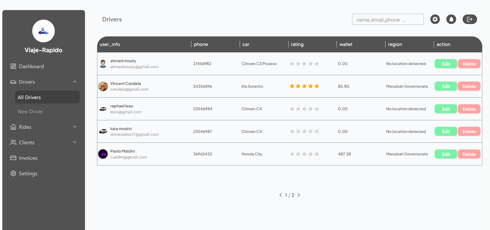
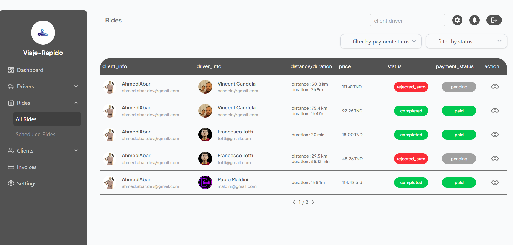

# Uber Like app


## 📸Some Screenshots

### 📱 Mobile App (Client & Driver)

<p align="center">
  
  
  
</p>

<p align="center">
  
  
  
</p>

<p align="center">
  
  
   
  
</p>

<p align="center">
  
  
</p>

<p align="center">
  
</p>


### 🖥️ Admin Dashboard

<p align="center">
  
</p>

<p align="center">
  
  
</p>

<p align="center">
  
  
</p>

<p align="center">
  
</p>


### Description  
Viaje Rápido is a full-stack Uber-like ride-hailing application, designed to provide a seamless and intuitive experience for both clients and drivers within a single mobile app. The app combines real-time ride management, communication, and analytics to deliver a complete mobility solution.

The system includes:

A mobile app (React Native Expo) supporting both client and driver roles.

A backend API built with Node.js, Express, and MongoDB.

An admin dashboard (React + TailwindCSS) for managing rides, users, drivers, and revenue.

---
## 🚀 Core Features  

### 1. Booking & Ride Management  
- Intuitive interface to **select pickup and drop-off locations** via an interactive map.  
- **Dynamic fare estimation** based on distance, time, and surge pricing.  
- **Ride scheduling** for future trips with automated reminders.  
- Flexible **cancellation system** with proper handling for both clients and drivers.  
- Optimized **ride assignment** to match clients with the nearest available driver.  

### 2. Real-time Tracking & Live Ride Status  
- **GPS-powered live tracking** of drivers and passengers on the map.  
- Instant updates for ride status transitions: **Requested → Accepted → In-Progress → Completed/Cancelled**.  
- **ETA (Estimated Time of Arrival) updates** refreshed in real-time for transparency.  
- **In-app driver-client communication** to ensure coordination during rides.  

### 3. Chat & Communication  
- Built-in **real-time chat** for clients and drivers.  
- Supports **multimedia messaging**: text, images, voice notes, and live location sharing.  

### 4. Payments  
- Multiple payment options: **cash or credit/debit card**.  
- **Secure integration with Stripe** for fast and reliable transactions.  
- Automatic **fare calculation** and **digital receipts** for every trip.  
- Flexible **refund and adjustment handling** for cancelled or disputed rides.  

### 5. Ride History & Analytics  
- Clients and drivers can view a **comprehensive history of past rides**.  
- Each ride includes **trip details, costs, receipts, and driver/client info**.  
- Admin dashboard features **real-time analytics**: revenue reports, ride volume, cancellations, and performance metrics.  
- Helps businesses **identify trends and optimize operations**.  

### 6. Ratings & Feedback  
- Two-way **rating system**: clients rate drivers, and drivers rate clients.  
- Feedback system helps maintain **trust, accountability, and service quality**.  
- Admins can **monitor reviews** and take action to ensure community standards.  

### 7. Notifications  
- **Push notifications** for ride confirmations, driver arrival alerts, payment confirmations, and cancellations.  
- Real-time **status change alerts** to keep both driver and passenger informed.  
- Configurable notification system for **promotions, offers, and reminders**.  


---

## 🎯 Project Goals
- Deliver a **safe, reliable, and efficient ride-hailing service**.  
- Enable **real-time communication and tracking** between drivers and clients.  
- Provide admins with **full visibility** of operations and key metrics.  
- Handle **secure file storage** for user images and documents via Cloudinary.  
- Ensure seamless **integration of maps, notifications, live ride status, and payments**.


## 🚀 Quick Start

> **Note:** The app repo is private. This is a public documentation guide.

### 1. Clone the repository (replace with your private repo URL)
```bash
git clone <YOUR_PRIVATE_REPO_URL>
cd viaje-rapido-app
npm install
