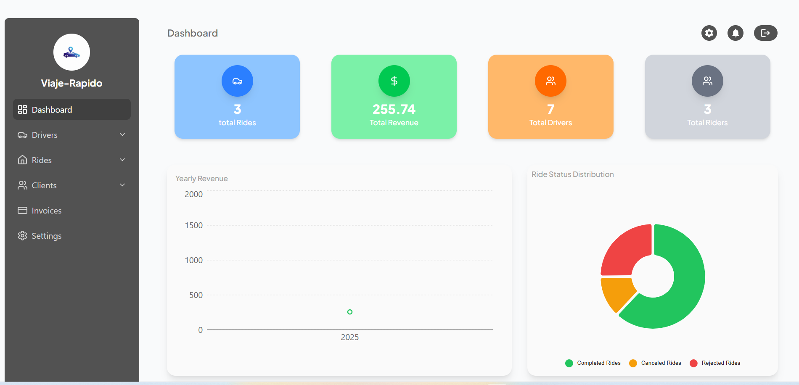
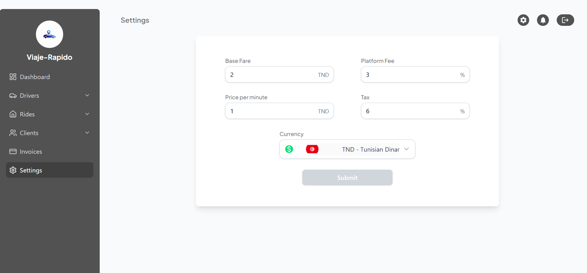

# ride-hailing app


## 📸 Screenshots

### 📱 Mobile App (Client & Driver)

<p align="center">
  
  
  
</p>

<p align="center">
  
  
  
</p>

<p align="center">
  
  
  
</p>

<p align="center">
  
  
  
</p>

<p align="center">
  
</p>


### 🖥️ Admin Dashboard

<p align="center">
  
</p>

<p align="center">
  
  
</p>

<p align="center">
  
  
</p>

<p align="center">
  
</p>
**Description:**  
Viaje Rápido is a full-stack Uber-like ride-hailing application, designed to provide a seamless and intuitive experience for both clients and drivers within a single mobile app. The app combines real-time ride management, communication, and analytics to deliver a complete mobility solution.

The system includes:

A mobile app (React Native Expo) supporting both client and driver roles.

A backend API built with Node.js, Express, and MongoDB.

An admin dashboard (React + TailwindCSS) for managing rides, users, drivers, and revenue.
---
## 🚀 Core Features

### 1. Booking & Ride Management
- Select **pickup and drop-off locations** with an interactive map.  
- **Fare estimation** and **ride scheduling** for future trips.  
- Ability to **cancel rides** with proper handling for both drivers and clients.  

### 2. Real-time Tracking & Live Ride Status
- **Live tracking** of drivers and passengers on the map.  
- **Live ride status updates**: requested → accepted → in-progress → completed or cancelled.  
- **ETA updates** and notifications for clients and drivers.  
- **Communication** between drivers and clients during rides.  

### 3. Chat & Communication
- **Real-time chat** between clients, drivers, and optionally admin support.  
- Messaging integrated seamlessly for ride updates, coordination, and support.  

### 4. Payments
- Support for **cash and card payments**.  
- Integration with **Stripe** for secure and smooth transactions.  

### 5. Ride History & Analytics
- Detailed **history of past trips** for clients and drivers.  
- **Receipts and summaries** for each completed ride.  
- Admin dashboard provides **analytics and revenue statistics**.  

### 6. Ratings & Feedback
- Clients can **rate drivers** and provide feedback for each trip.  
- Drivers can **rate clients** to maintain a healthy community ecosystem.  

### 7. Notifications
- **Push notifications** for ride confirmations, updates, cancellations, and arrivals.  
- Alerts for **ride status changes**, driver arrivals, and payment confirmations.  

---

## 🎯 Project Goals
- Deliver a **safe, reliable, and efficient ride-hailing service**.  
- Enable **real-time communication and tracking** between drivers and clients.  
- Provide admins with **full visibility** of operations and key metrics.  
- Handle **secure file storage** for user images and documents via Cloudinary.  
- Ensure seamless **integration of maps, notifications, live ride status, and payments**.


## 🚀 Quick Start

> **Note:** The app repo is private. This is a public documentation guide.

### 1. Clone the repository (replace with your private repo URL)
```bash
git clone <YOUR_PRIVATE_REPO_URL>
cd viaje-rapido-app
npm install
